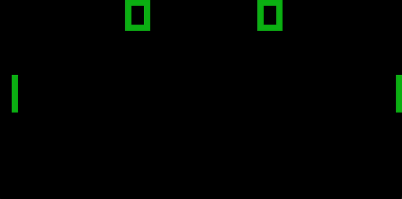

# CHIP-8 Emulator

A CHIP-8 interpreter/emulator written in C++, rendered with [raylib](https://www.raylib.com/).

## Demo

| Pong | Tetris |
|:---:|:---:|
|  |  |

## Features

- Full CHIP-8 instruction set implemented via a fast function-pointer table
- Configurable display scale and CPU cycle delay from the command line
- Keyboard input mapped to the original 16-key CHIP-8 keypad
- Delay and sound timers updated independently of the CPU clock, at the correct 60Hz
- Simple, dependency-light rendering using raylib

## Project Structure

```
.
├── chip8.hpp        # Chip8 class definition, memory/register layout, opcode declarations
├── chip8.cpp         # Opcode implementations, fetch-decode-execute cycle
├── main.cpp          # raylib window/input/render loop
└── README.md
```

## Requirements

- A C++17 (or later) compiler
- [raylib](https://github.com/raysan5/raylib) installed and available to your linker
- CMake

## Building using CMake

```bash
git clone https://github.com/<your-username>/<your-repo>.git
cd <your-repo>
mkdir build && cd build
cmake ..
cmake --build .
```

## Usage

```bash
./chip8 <SCALE> <DELAY> <ROM>
```

| Argument | Description |
|---|---|
| `SCALE`  | Pixel scale factor. CHIP-8's native resolution is 64x32, so a scale of `10` gives a 640x320 window. |
| `DELAY`  | Cycle delay in milliseconds — controls emulation speed. Lower is faster. `1`–`3` works good. |
| `ROM`    | Path to the CHIP-8 ROM file (`.ch8`) to load. |

Example:

```bash
./chip8 10 2 roms/PONG.ch8
```

Public domain CHIP-8 ROMs (Pong, Tetris, Space Invaders, and more) can be found in collections like [dmatlack/chip8](https://github.com/dmatlack/chip8/tree/master/roms) or [kripod/chip8-roms](https://github.com/kripod/chip8-roms).

## Controls

The original CHIP-8 keypad is mapped to the modern keyboard as follows:

**CHIP-8 keypad**
```
1 2 3 C
4 5 6 D
7 8 9 E
A 0 B F
```

**Keyboard mapping**
```
1 2 3 4
Q W E R
A S D F
Z X C V
```

## How It Works

- **Memory**: 4KB of RAM, with programs loaded starting at `0x200`. The built-in font set for hex digits `0`–`F` is loaded at `0x50`.
- **Registers**: 16 general-purpose 8-bit registers (`V0`–`VF`), a 16-bit index register, a program counter, and a stack for subroutine calls.
- **Fetch-Decode-Execute**: Each cycle reads a 2-byte opcode from memory, and dispatches it through a table of function pointers keyed on the opcode's first nibble (with secondary tables for the `0`, `8`, `E`, and `F` opcode families).
- **Timers**: The delay and sound timers tick down at 60Hz, decoupled from the main CPU cycle rate so emulation speed can be tuned independently.
- **Display**: A 64x32 monochrome framebuffer, drawn each frame as scaled rectangles via raylib.


## Acknowledgements

- [Cowgod's CHIP-8 Technical Reference](http://devernay.free.fr/hacks/chip8/C8TECH10.HTM) — the opcode specification
- [Austin Morlan's "Building a CHIP-8 Emulator"](https://austinmorlan.com/posts/chip8_emulator/) blog post
- [raylib](https://www.raylib.com/) for handling the rendering logic and user input side

## License

This project is licensed under the MIT License — see [LICENSE](LICENSE) for details.
